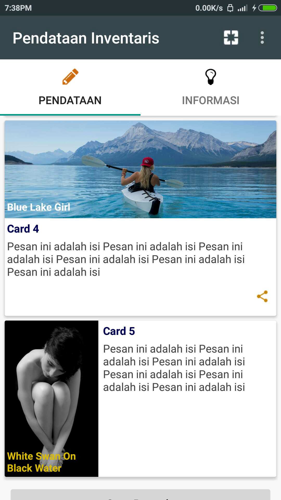

# Cordova - TabrisJS CardView plugin

for Android and iOS, by [Joko Rivai](https://github.com/jokorivai)


## 0. Index

1. [Description](#1-description)
2. [Screenshots](#2-screenshots)
3. [Installation](#3-installation)
	3. [Automatically (Cordoa CLI)](#automatically-cordova-cli)
	3. [Manually](#manually)
4. [Usage](#4-usage)
5. [Credits](#5-credits)
6. [Changelog](#6-changelog)

## 1. Description

This plugin allows you to create card view using plain javascript. Only for TabrisJS apps. Supported on Android and iOS (as platforms supported by TabrisJS).
Currently [TabrisJS](https://tabrisjs.com/) is not supporting CardView yet, so this plugin may help you create similar view based on TabrisJS widget library.
* You can specify card's title, image and text to show.
* You can specify actions for the card. Actions are tabris.Buttons and may be added as much as needed, but please consider card space available for them.
* Each action can have callback 
* You can change the card's title, image and text at runtime.
* Compatible with [Cordova CLI](https://cordova.apache.org/docs/en/latest/reference/cordova-cli/index.html).

## 2. Screenshots

iOS

Not yet.


Android





## 3. Installation

### Automatically (Cordova CLI)
Cordova - TabrisJS CardView plugin is compatible with [Cordova CLI](https://cordova.apache.org/docs/en/latest/reference/cordova-cli/index.html), here's how it works with the CLI (backup your project first!):

Using the Cordova CLI and the [Cordova Plugin Registry](http://plugins.cordova.io)
```
$ cordova plugin add cordova-plugin-tabrisjs-card
```

Or instal using Git repository
```
$ cordova plugin add https://github.com/jokorivai/cordova-plugin-tabrisjs-card.git
```

tabrisjscard.js is brought in automatically. There is no need to change or add anything in your code to make it available.
Please note that this plugin is NOT for HTML/WebView based Cordova apps. This plugin is ONLY for TabrisJS Cordova apps.

To create card, call
```js
// reference to the plugin
var createCard = window.tabrisJsPlugins.cards.createCard;
// create card:
createCard(...);
```

Or
```js
window.tabrisJsPlugins.cards.createCard(...);
```

### Manually
You'd better use the CLI, but here goes:

Grab a copy of `tabrisjscard.js`, from `extracted-zip\www\` and put it to your project's `www` folder and reference it:
```js
var createCard = require('./tabrisjscard.js').createCard;
```

## 4. Usage

### Creating a card
Cards created by this plugin are TabrisJS UI widget composite. The composite will be returned by `createCard()` function and can be manipulated as usual TabrisJS UI widgets.

To create plain card on a page (top is always 0 with 3dp margin):
```js
var card1 = createCard('Card1 Content', 'Card1 Title').appendTo(page);
```

To create plain card on a page, top to another widget with 3dp margin:
```js
var card2 = createCard('Card2 Content', 'Card2 Title', {
  adjacentTop: card1
}).appendTo(page);
```

To create plain card without title on a page, top to another widget with 3dp margin:
```js
var card3 = createCard('Card3 Content', '', {
  adjacentTop: card2
}).appendTo(page);
```

To create card on a page, top to another widget with 3dp margin, with image at top/left side:
```js
var card4 = createCard('Card4 Content', 'Card4 Title', {
  adjacentTop: card3,
  image: 'images/010.jpg',
  imagePosition: 'top', // or 'left'. right and bottom are not supported.
}).appendTo(page);
```

To create card on a page, top to another widget with 3dp margin, with image at top/left side, and add some actions at bottom bar:
```js
var card5 = createCard('This is card5 content', 'Card 5', {
  adjacentTop: card4,
  image: 'images/009.jpg',
  imagePosition: 'top',
  height: 250, // width is not supported, it always be parent's width minus margins at left and right side.
  actions: [
    {image: 'img/share.png', action: function(theCard, theButton){
      // Tapped on theButton of theCard
    }},
    {text: 'Great!', action: function(theCard, theButton){
      showToast('great!'); // please add Toast to enable showToast
    }}
  ]
}).appendTo(page);
```

To create card on a page with `tap event` and change the card's image:
```js
var card6 = createCard('Card6 Content', 'Card6 Title', {
  adjacentTop: card5,
  image: 'images/010.jpg',
  imagePosition: 'top', // or 'left'. right and bottom are not supported.
}).on('tap', function(widget, gesture){
  showToast('tapped on card 6');
  card6.image.set('image', {src: 'images/007.jpg'});
}).appendTo(page);
```

To create card on a page with Image Caption and separate action color and position:
```js
var card7 = createCard('Card7 Content', 'Card7 Title', {
  adjacentTop: card6,
  image: 'images/001.jpg',
  imageCaption: 'Blue Lake Girl',
  imageCaptionColor: '#ffffff',
  imagePosition: 'top',
  actions: [
    {color: '#ff0000', position:'right', image: 'img/share.png', action: function(theCard, theButton){
      var opts = {
        message: 'Share content for card 6',
        subject: 'Share card 6',
        chooserTitle: 'Bagikan'
      };
      window.plugins.socialsharing.shareWithOptions(opts, function(r){}, function(e){});
    }},
    {color: '#0000ff', position:'left', text: 'snap', image: 'img/camera.png', action: function(theCard, theButton){
      showToast('Share');
    }},
    {position:'left', text: 'Great!', action: function(theCard, theButton){
      showToast('great!');
    }}
  ]
}).appendTo(page);
```

#### Accessing Card Members
You can access card's members as follows:

```js
var card6 = createCard('Card6 Content', 'Card6 Title', {
  adjacentTop: card5,
  image: 'images/010.jpg',
  imagePosition: 'top', // or 'left'. right and bottom are not supported.
}).on('tap', function(widget, gesture){
  showToast('tapped on card 6');
  card6.image.set('image', {src: 'images/007.jpg'});
}).appendTo(page);

//--------------------
card6.title.set('text', 'New Title For Card6'); 
// ---- only when you specify title (non empty string) on card creation.
card6.content.set('text', 'New content For Card6');
card6.image.set('image', {src:'newimage.jpg'}); 
// ---- only when you specify valid image on card creation.
card6.actions[0].set('image', 'icons/icon-share.png'); 
// ---- card6.actions.length would be 0 
// ---- if no actions were specified on card creation
Card6.imageCaption.set('text', 'New Image Caption');
```

### Diposing a Card
Card can be disposed as usual TabrisJS widgets:
```js
card6.dispose();
```

### Creation function
Here is the function for creating the card:

```js
createCard(
  cardContent,  //string
  cardTitle,    //string  
  {
    cornerRadius, // integer, default 3
    adjacentTop,  // TabrisJS UI widget, default null,
    elevation,    // integer, raise the card with shadow effect, Android 5+ only
    background    // string, CSS color, either 'rgb(a,b,c)', '#abc' or '#aabbcc'
    left          // integer, default 6
    right         // integer, default 6
    height        // integer, default 200    
    image: 'images/010.jpg', // string. {src: '...'} is not supported
    imagePosition: 'top', // or 'left'. right and bottom are not supported,
    imageCaption, // string, text to display on top of image,
    imageCaptionColor,
                  // string, CSS color
    actions       // array of object, see below...
  }
);
```

`Card Actions` is an array of object, as:
```js
{
  image:'img.png',  // string, image uri
  text: 'text',     // string, arbitrary text
  color: '#ff0000', // string, CSS color
  position: 'left'  // string, 'left' or 'right', defaults to 'right'
  action: function(theCard, theAction){}
  }
```

## 5. CREDITS

This plugin is based on [TabrisJS](http://tabrisjs.com).
The Javascript code was entirely created by me.

This library is now trying to stick on Google Material Design specs, thanks to [mpost](https://github.com/mpost) for commenting
on [This TabrisJS Issue](https://github.com/eclipsesource/tabris-js/issues/886).

## 6. CHANGELOG

2016-10-14: 
  * Add options for Card: `imageCaption` and `imageCaptionColor`.
  * Remove margin around Card image (accourding to Material Design Specs for Card).
  * Card Actions change from Button to Composite (because TabrisJS UI Button always have border and shadow - `elevation` cannot be set to 0).
  * Card Actions change, now each action item can have its own foreground color.
  * Card Actions change, now each action item can have its own position on Card Action Bar ('left' or 'right').
